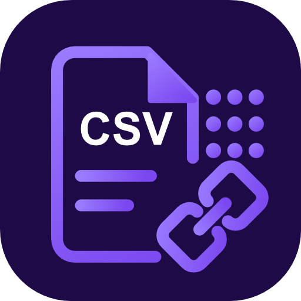
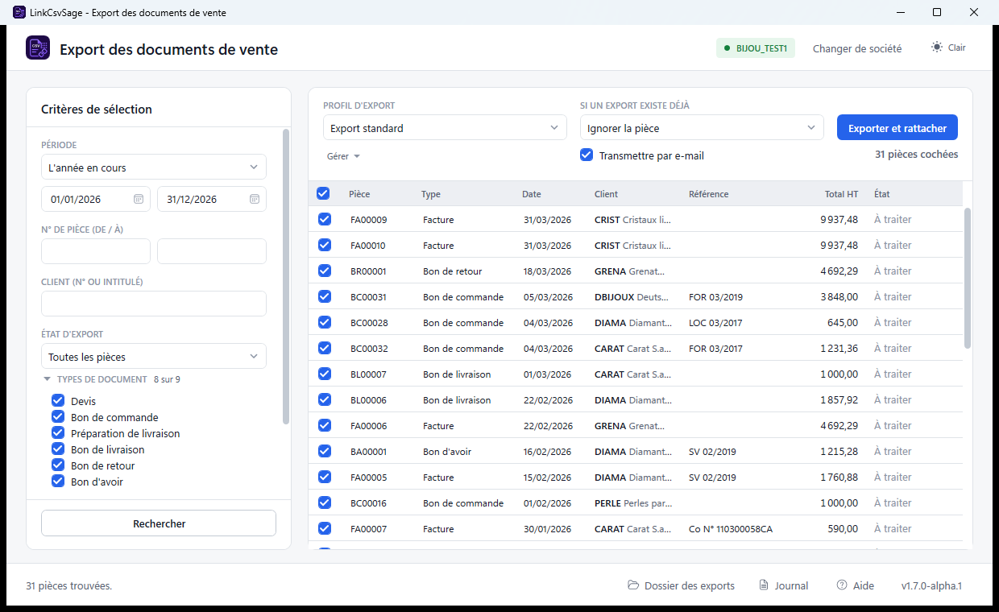
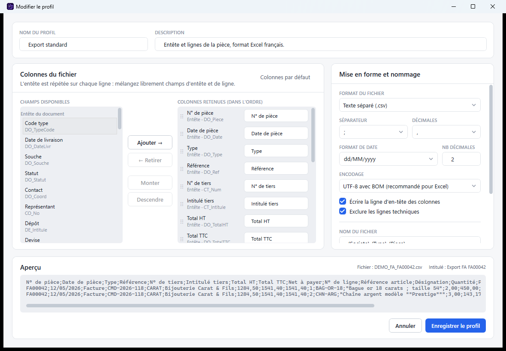
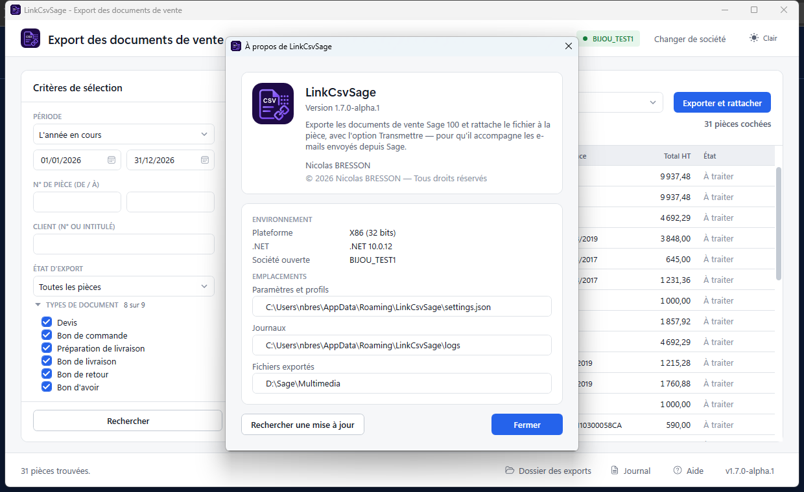

<p align="center">
  
</p>

<h1 align="center">LinkCsvSage</h1>

<p align="center">
  Vos documents de vente Sage 100, exportés et <b>rattachés à la pièce</b> —
  pour qu'ils accompagnent vos e-mails.
</p>

<p align="center">
  <a href="../../releases/latest"><b>Télécharger la dernière version</b></a>
</p>



## À quoi ça sert

Vous envoyez une facture par e-mail depuis Sage, et votre client — ou votre
logiciel comptable — attend le détail dans un fichier exploitable. Il faut alors
exporter à la main, retrouver le fichier, l'attacher au message. Pour chaque
pièce.

LinkCsvSage fait les trois en un clic, depuis la facture ouverte dans Sage :

1. il génère le fichier — **CSV, Excel ou JSON**, avec les colonnes que vous avez
   choisies ;
2. il le range dans les **Documents liés** de la pièce ;
3. il coche **Transmettre**, si bien que le fichier part avec l'e-mail, sans que
   vous ayez à y penser.

Vous pouvez aussi traiter **un lot entier** depuis l'application : toutes les
factures d'un mois, d'un client, d'un dépôt.

## Installer

1. Téléchargez le paquet **autonome** de la [dernière version](../../releases/latest).
2. Décompressez-le dans `%LOCALAPPDATA%\Programs\LinkCsvSage`.
3. Lancez `LinkCsvSage.exe`.

Aucune installation, aucun droit administrateur. Les paramètres vivent dans votre
profil utilisateur ; le dossier d'installation ne contient rien de personnel.

> **Pourquoi cet emplacement ?** Vous pouvez y écrire, donc les mises à jour
> s'installent toutes seules. Dans `C:\Program Files (x86)`, chacune réclamera un
> mot de passe administrateur. Les deux fonctionnent.

## Rester à jour

L'application s'en charge. Une fois par jour au lancement, elle regarde s'il
existe une version plus récente et vous la propose, avec la liste de ce qui
change.

Vous acceptez : elle télécharge, se remplace et se rouvre. Rien d'autre à faire.

Vous refusez : rien ne se passe. *Ignorer cette version* ne concerne que
celle-là — la suivante vous sera proposée. Le bouton **Rechercher une mise à
jour** d'*À propos* permet d'y revenir quand vous voulez.

Elle ne se met **jamais à jour d'elle-même**, et ne vérifie rien quand vous
l'appelez depuis Sage : vous êtes alors sur un document ouvert, ce n'est pas le
moment.

### Ce qu'il faut sur le poste

| | |
|---|---|
| **Windows** | 10 ou 11 |
| **Sage 100** | Gestion commerciale, avec le **Runtime Objets Métiers** installé |
| **Accès** | au serveur SQL de la société, en authentification Windows |

Le paquet *autonome* n'exige rien d'autre. Un paquet *framework*, plus léger, est
également publié pour les postes disposant déjà du runtime .NET **32 bits**.

> LinkCsvSage fonctionne en 32 bits, sans alternative : le composant Objets
> Métiers de Sage n'existe que sous cette forme.

## Déclarer le bouton dans Sage

*Fenêtre / Personnaliser l'interface / Programmes externes*, contexte
**Documents des ventes** :

```
Type        : Exécutable
Programme   : <dossier d'installation>\LinkCsvSage.exe
Arguments   : --piece "$(DocEntete.NumPiece)" --type "$(DocEntete.Type)"
              --gcm "$(Dossier.LocalisationCommercial)"
```

Deux cases à laisser **décochées** : *Attendre la fin de l'exécution de la
commande* et *Fermer la société en cours avant exécution*.

La procédure complète — mise à jour, codes de retour, diagnostic — est dans le
fichier `DEPLOIEMENT.md` livré avec le paquet.

## Choisir ce qui est exporté



Un **profil d'export** décrit les colonnes, leur ordre, leurs libellés, le format
et le nom du fichier. Vous en composez autant que nécessaire — un pour votre
comptable, un pour tel client — et l'aperçu montre le résultat pendant que vous
réglez.

## Obtenir de l'aide

La fenêtre **À propos** rassemble ce qui est demandé en cas de souci : version,
environnement et emplacement des journaux.



---

<p align="center">
  <sub>Les publications de ce dépôt sont produites automatiquement à partir du
  code source, qui est privé.</sub>
</p>
